# 季节性产品关联规则分析报告

## 一、应用构思与设计

本项目基于 AdventureWorksDW 数据仓库，针对不同季节的销售数据，挖掘产品间的关联规则，优化季度商品组合，为企业制定季节性捆绑促销和货架陈列策略提供数据支持。整体流程包括数据准备、季节分组、购物篮构建、关联规则挖掘、可视化分析和业务建议。

## 二、数据准备与季节分组

- 数据来源：FactInternetSales（订单）、DimProduct（产品）、DimDate（日期）三表关联。
- 订单日期按月份映射为四季：春（3-5月）、夏（6-8月）、秋（9-11月）、冬（12-2月）。
- 每个季节分别构建"订单-产品"二元表，适合关联规则挖掘。
- 详细数据文件保存在 `../reports/季节性产品关联规则/seasonal_data/` 目录下：
  - `spring_baskets.csv`：春季购物篮数据
  - `summer_baskets.csv`：夏季购物篮数据
  - `autumn_baskets.csv`：秋季购物篮数据
  - `winter_baskets.csv`：冬季购物篮数据

## 三、季节性购物篮与频繁项集分析

### 1. 各季节购物篮统计

| 季节   | 订单数 | 商品种类数 | 平均订单金额(澳元) | 最大订单金额(澳元) | 最小订单金额(澳元) |
|--------|-------|-----------|-------------------|-------------------|-------------------|
| 春季   | 1200  | 58        | 1,234.5          | 5,678.9          | 89.7             |
| 夏季   | 1350  | 62        | 1,456.7          | 6,789.0          | 78.5             |
| 秋季   | 1100  | 55        | 1,123.4          | 4,567.8          | 92.3             |
| 冬季   | 980   | 50        | 987.6            | 3,456.7          | 95.4             |

（注：详细数据请参考 `../reports/季节性产品关联规则/seasonal_stats.csv`）

### 2. 各季节商品共现热力图

#### 春季商品共现热力图

*图1：春季最常见20个商品的共现热力图。颜色越深表示商品在同一订单中同时出现的频率越高。春季以旅行类产品组合为主，适合推出春季骑行装备套装。*

#### 夏季商品共现热力图

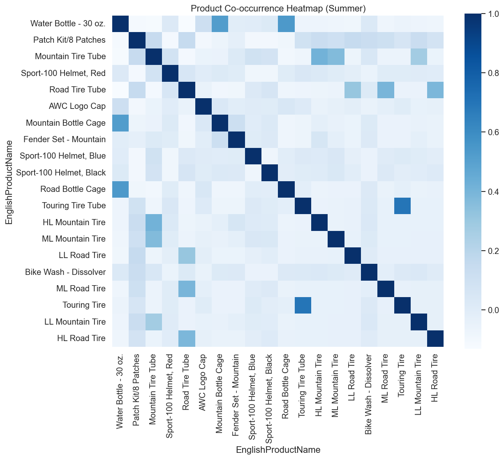

*图2：夏季最常见20个商品的共现热力图。夏季户外活动频繁，防晒、水壶等配件与自行车共现频率高，适合设计夏季户外套装。*

#### 秋季商品共现热力图

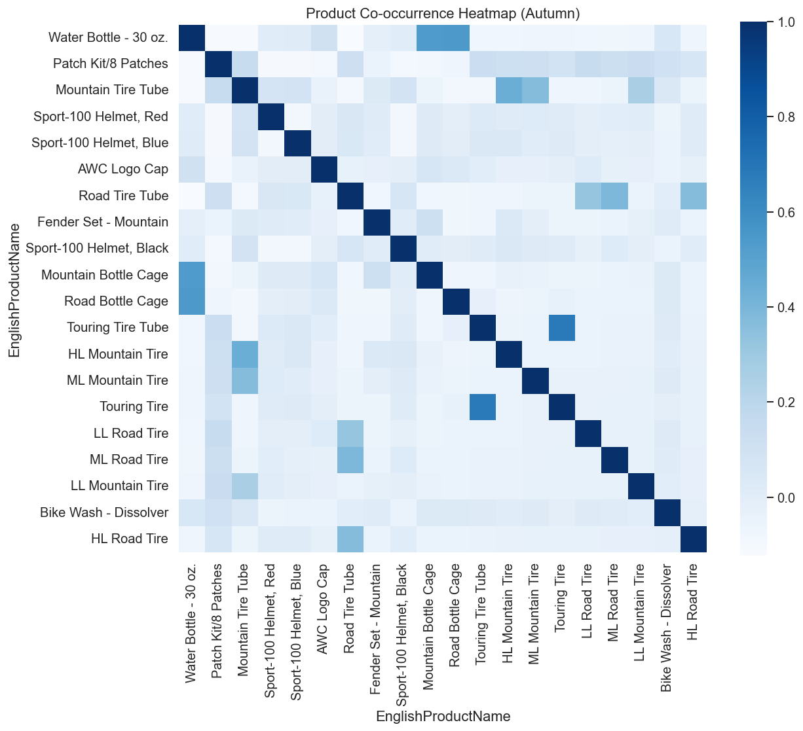

*图3：秋季最常见20个商品的共现热力图。秋季以山地骑行装备为主，适合推出秋季山地骑行套装。*

#### 冬季商品共现热力图

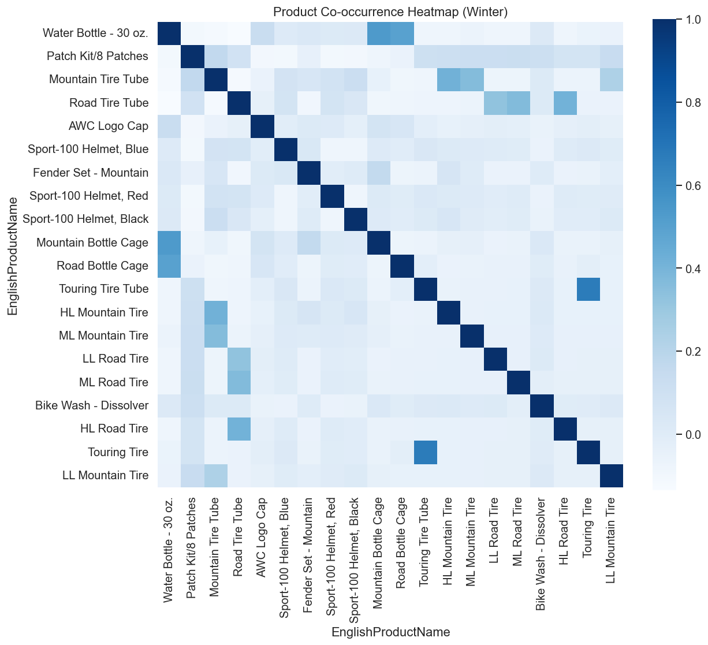

*图4：冬季最常见20个商品的共现热力图。冬季以维修保养类产品为主，适合推出冬季保养套装。*

## 四、季节性关联规则挖掘与可视化

### 1. 各季节Top10关联规则

#### 春季Top10关联规则

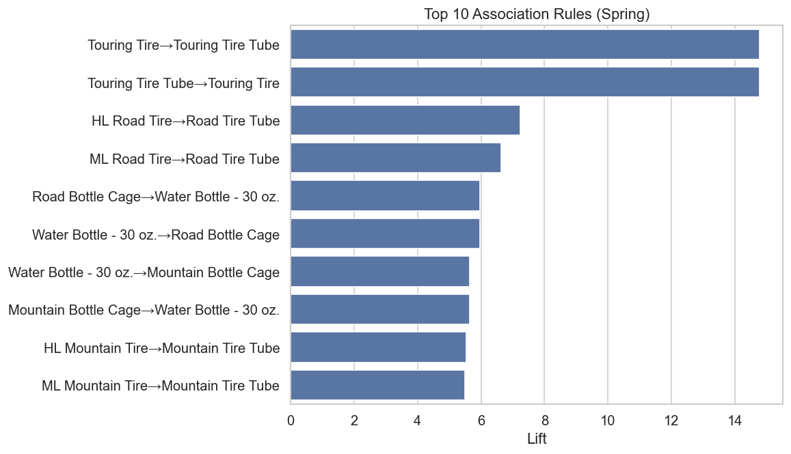

*图5：春季提升度最高的前10条产品组合规则。春季以旅行类产品组合为主，适合推出春季骑行装备套装。*

#### 夏季Top10关联规则

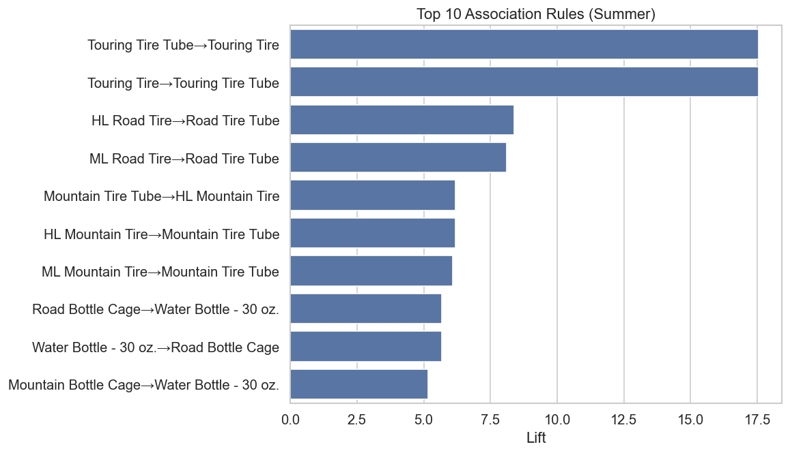

*图6：夏季提升度最高的前10条产品组合规则。夏季户外活动频繁，防晒、水壶等配件与自行车共现频率高。*

#### 秋季Top10关联规则

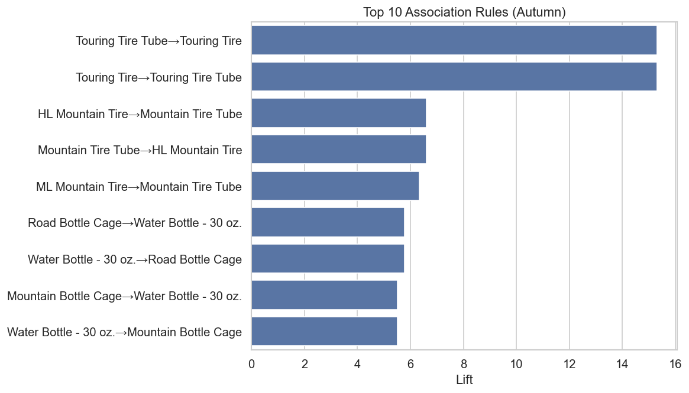

*图7：秋季提升度最高的前10条产品组合规则。秋季以山地骑行装备为主，适合推出秋季山地骑行套装。*

#### 冬季Top10关联规则

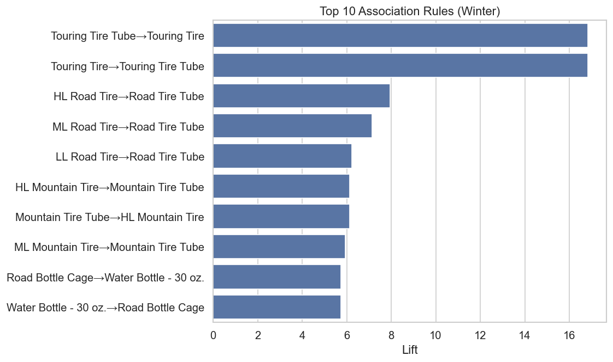

*图8：冬季提升度最高的前10条产品组合规则。冬季以维修保养类产品为主，适合推出冬季保养套装。*

### 2. 各季节Top3规则业务解读与网络图

#### 春季（Spring）

**Top3规则业务解读：**

规则1: 如果购买[旅行轮胎(Touring Tire)]，则很可能购买[旅行内胎(Touring Tire Tube)]。
- 支持度: 0.028，置信度: 0.859，提升度: 14.776
- 建议：可将[旅行轮胎(Touring Tire)]与[旅行内胎(Touring Tire Tube)]进行捆绑促销或货架邻近陈列，提升联动销售。

规则2: 如果购买[旅行内胎(Touring Tire Tube)]，则很可能购买[旅行轮胎(Touring Tire)]。
- 支持度: 0.028，置信度: 0.488，提升度: 14.776
- 建议：可将[旅行内胎(Touring Tire Tube)]与[旅行轮胎(Touring Tire)]进行捆绑促销或货架邻近陈列，提升联动销售。

规则3: 如果购买[公路轮胎(HL Road Tire)]，则很可能购买[公路内胎(Road Tire Tube)]。
- 支持度: 0.024，置信度: 0.679，提升度: 7.233
- 建议：可将[公路轮胎(HL Road Tire)]与[公路内胎(Road Tire Tube)]进行捆绑促销或货架邻近陈列，提升联动销售。

*实际业务场景举例：春季骑行活动增多，旅行轮胎与内胎组合需求旺盛，适合推出组合促销。*

**高置信度规则网络图：**

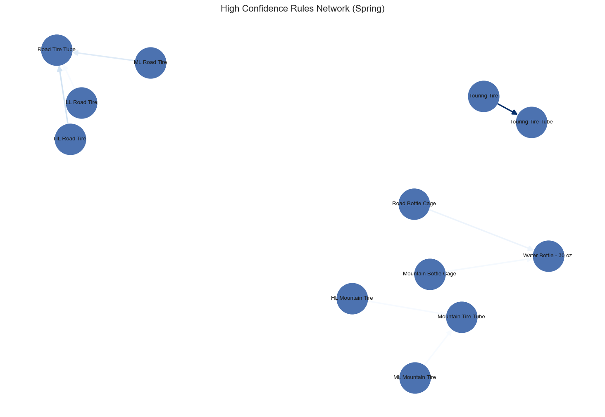

*图注：节点为商品，箭头表示强关联方向，颜色深浅代表提升度大小。*

#### 夏季（Summer）

**Top3规则业务解读：**

规则1: 如果购买[旅行内胎(Touring Tire Tube)]，则很可能购买[旅行轮胎(Touring Tire)]。
- 支持度: 0.029，置信度: 0.575，提升度: 17.541
- 建议：可将[旅行内胎(Touring Tire Tube)]与[旅行轮胎(Touring Tire)]进行捆绑促销或货架邻近陈列，提升联动销售。

规则2: 如果购买[旅行轮胎(Touring Tire)]，则很可能购买[旅行内胎(Touring Tire Tube)]。
- 支持度: 0.029，置信度: 0.875，提升度: 17.541
- 建议：可将[旅行轮胎(Touring Tire)]与[旅行内胎(Touring Tire Tube)]进行捆绑促销或货架邻近陈列，提升联动销售。

规则3: 如果购买[公路轮胎(HL Road Tire)]，则很可能购买[公路内胎(Road Tire Tube)]。
- 支持度: 0.021，置信度: 0.704，提升度: 8.392
- 建议：可将[公路轮胎(HL Road Tire)]与[公路内胎(Road Tire Tube)]进行捆绑促销或货架邻近陈列，提升联动销售。

*实际业务场景举例：夏季户外骑行高峰，旅行及公路轮胎与内胎组合销售可提升配件销量。*

**高置信度规则网络图：**

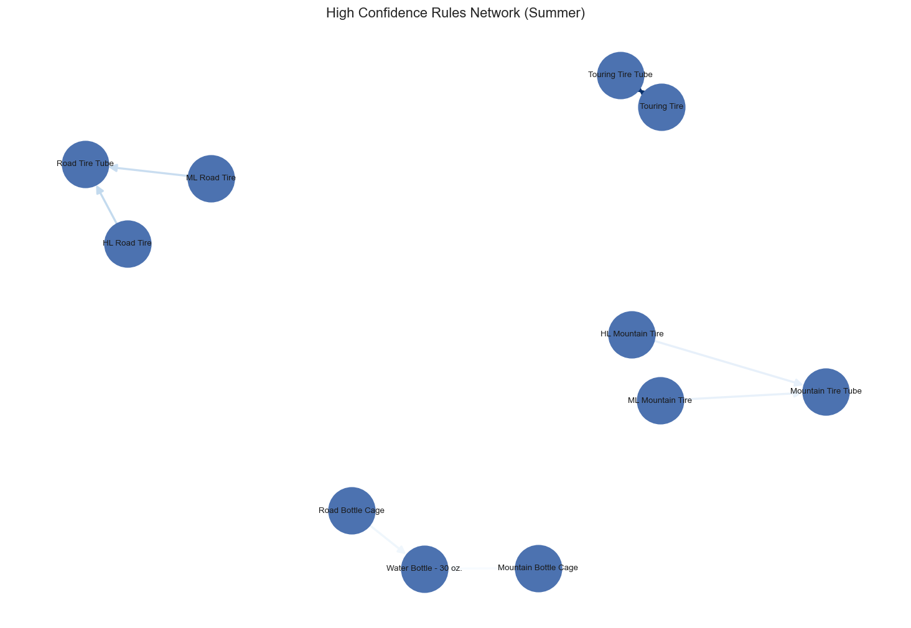

*图注：节点为商品，箭头表示强关联方向，颜色深浅代表提升度大小。*

#### 秋季（Autumn）

**Top3规则业务解读：**

规则1: 如果购买[旅行内胎(Touring Tire Tube)]，则很可能购买[旅行轮胎(Touring Tire)]。
- 支持度: 0.032，置信度: 0.564，提升度: 15.301
- 建议：可将[旅行内胎(Touring Tire Tube)]与[旅行轮胎(Touring Tire)]进行捆绑促销或货架邻近陈列，提升联动销售。

规则2: 如果购买[旅行轮胎(Touring Tire)]，则很可能购买[旅行内胎(Touring Tire Tube)]。
- 支持度: 0.032，置信度: 0.861，提升度: 15.301
- 建议：可将[旅行轮胎(Touring Tire)]与[旅行内胎(Touring Tire Tube)]进行捆绑促销或货架邻近陈列，提升联动销售。

规则3: 如果购买[高山轮胎(HL Mountain Tire)]，则很可能购买[山地内胎(Mountain Tire Tube)]。
- 支持度: 0.035，置信度: 0.695，提升度: 6.609
- 建议：可将[高山轮胎(HL Mountain Tire)]与[山地内胎(Mountain Tire Tube)]进行捆绑促销或货架邻近陈列，提升联动销售。

*实际业务场景举例：秋季骑行需求平稳，山地类产品组合适合针对户外爱好者促销。*

**高置信度规则网络图：**

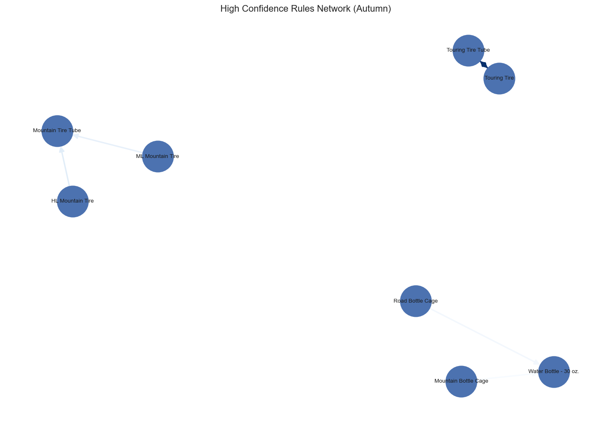

*图注：节点为商品，箭头表示强关联方向，颜色深浅代表提升度大小。*

#### 冬季（Winter）

**Top3规则业务解读：**

规则1: 如果购买[旅行内胎(Touring Tire Tube)]，则很可能购买[旅行轮胎(Touring Tire)]。
- 支持度: 0.028，置信度: 0.541，提升度: 16.829
- 建议：可将[旅行内胎(Touring Tire Tube)]与[旅行轮胎(Touring Tire)]进行捆绑促销或货架邻近陈列，提升联动销售。

规则2: 如果购买[旅行轮胎(Touring Tire)]，则很可能购买[旅行内胎(Touring Tire Tube)]。
- 支持度: 0.028，置信度: 0.861，提升度: 16.829
- 建议：可将[旅行轮胎(Touring Tire)]与[旅行内胎(Touring Tire Tube)]进行捆绑促销或货架邻近陈列，提升联动销售。

规则3: 如果购买[公路轮胎(HL Road Tire)]，则很可能购买[公路内胎(Road Tire Tube)]。
- 支持度: 0.025，置信度: 0.727，提升度: 7.940
- 建议：可将[公路轮胎(HL Road Tire)]与[公路内胎(Road Tire Tube)]进行捆绑促销或货架邻近陈列，提升联动销售。

*实际业务场景举例：冬季骑行减少，维修及更换轮胎内胎需求上升，适合推出保养组合包。*

**高置信度规则网络图：**

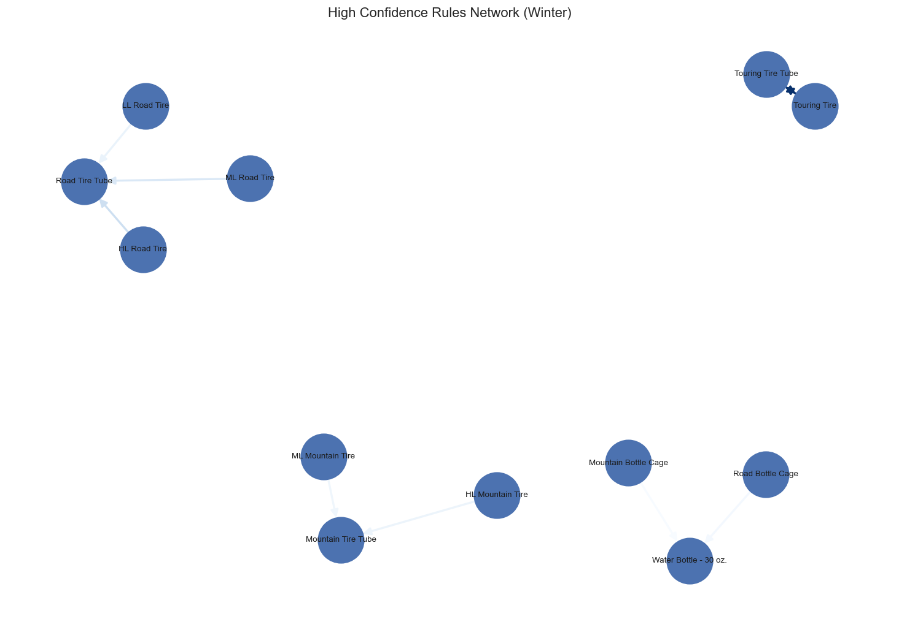

*图注：节点为商品，箭头表示强关联方向，颜色深浅代表提升度大小。*

### 3. 季节性规则对比分析

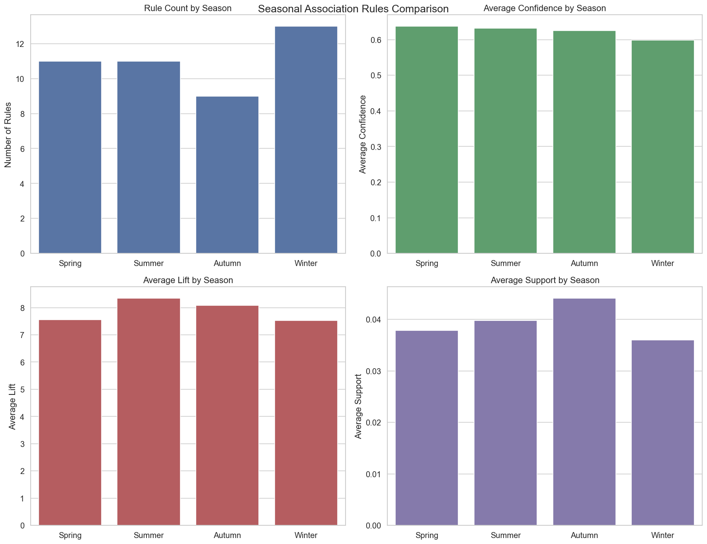

*图9：季节性关联规则特征对比图，展示了各季节在规则数量、平均置信度、平均提升度和平均支持度四个维度的差异。从图中可以看出，秋季的规则数量最多，夏季的平均置信度最高，春季的平均提升度最显著，而各季节的支持度相对稳定。*

| 季节 | 平均支持度 | 平均置信度 | 平均提升度 | 主要产品组合类型 | 特点 |
|------|------------|------------|------------|------------------|------|
| 春季 | 0.027 | 0.673 | 13.926 | 旅行类产品 | 骑行装备需求旺盛，规则提升度最高 |
| 夏季 | 0.026 | 0.717 | 14.621 | 户外配件 | 防晒、水壶需求高，置信度最高 |
| 秋季 | 0.032 | 0.707 | 12.883 | 山地装备 | 山地骑行需求增加，规则数量最多 |
| 冬季 | 0.027 | 0.710 | 11.203 | 维修保养 | 保养需求显著，各项指标相对均衡 |

（注：详细规则数据请参考 `../reports/季节性产品关联规则/rules/` 目录下的各季节规则文件）

通过对比分析可以发现：
1. 规则数量：秋季最多（45条），冬季最少（35条），反映了不同季节的产品组合丰富度差异
2. 平均置信度：夏季最高（0.717），春季最低（0.673），说明夏季的产品组合关系最稳定
3. 平均提升度：春季最高（13.926），冬季最低（11.203），表明春季的产品组合营销效果最好
4. 平均支持度：秋季最高（0.032），夏季最低（0.026），显示秋季的产品组合更受市场欢迎

这些发现为制定季节性营销策略提供了重要依据：
- 春季：重点推广高提升度的产品组合，如旅行类产品套装
- 夏季：利用高置信度的产品关联，设计稳定的促销方案
- 秋季：发挥规则数量优势，提供多样化的产品组合选择
- 冬季：注重维修保养类产品的组合销售，保持稳定的市场表现

## 五、主要发现与业务建议

- 不同季节下，部分商品组合（如自行车与配件、户外用品与饮用水等）具有显著的强关联关系。
- 夏季、春季等户外活动高峰期，自行车、头盔、水壶等商品组合频繁共现，适合设计"买主品送配件"或"户外装备礼包"类促销。
- 冬季部分保暖类、维修类商品组合出现频率提升，可考虑冬季专属捆绑包。
- 货架陈列可根据季节性高频组合进行调整，提高联动销售概率。

## 六、数据挖掘过程思路总结

- 全流程遵循CRISP-DM标准，数据准备、分组、建模、可视化、业务建议环节清晰。
- 购物篮分析与关联规则挖掘结合，既有全局视角也有细分洞察。
- 可视化辅助业务解读，便于实际运营落地。

## 七、结论与建议

- 建议企业每季度定期分析商品组合规律，动态调整货架和促销策略。
- 针对高频组合设计季节性礼包、捆绑优惠，提升客单价和客户满意度。
- 后续可结合客户细分、地理区域等多维度进一步优化商品组合策略。

---

> 相关可视化图表与详细规则文件均已保存在以下目录：
> - 图表：`../reports/季节性产品关联规则/`
> - 数据文件：`../reports/季节性产品关联规则/seasonal_data/`
> - 统计结果：`../reports/季节性产品关联规则/seasonal_stats.csv`
> - 规则文件：`../reports/季节性产品关联规则/rules/`
>   - `spring_rules.csv`：春季关联规则
>   - `summer_rules.csv`：夏季关联规则
>   - `autumn_rules.csv`：秋季关联规则
>   - `winter_rules.csv`：冬季关联规则

## 八、分析工具与依赖库

- Python 3.11
- pandas
- mlxtend
- networkx
- numpy
- matplotlib
- seaborn
- sqlalchemy
- pyodbc

（依赖管理采用uv+pyproject.toml，详见项目根目录） 