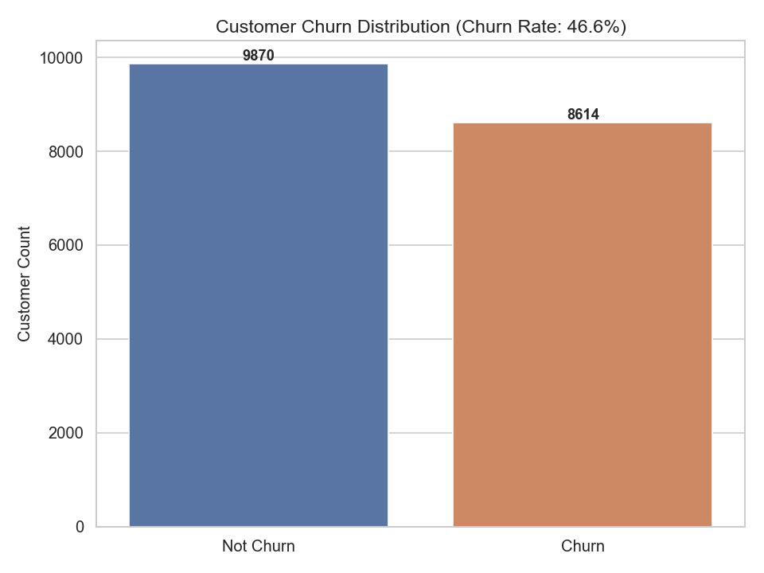
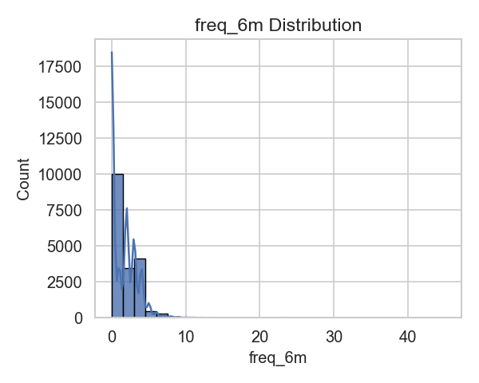
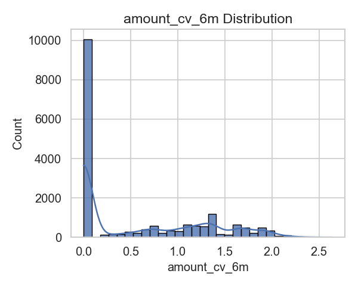
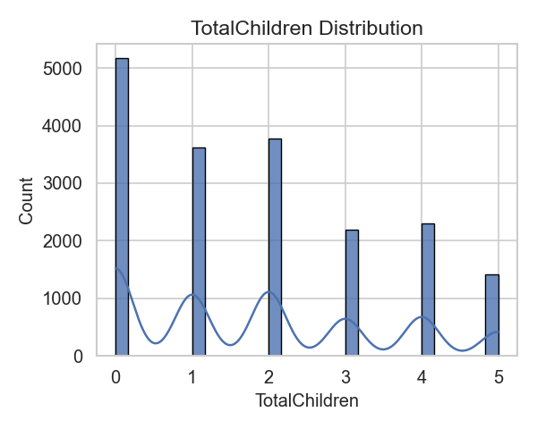
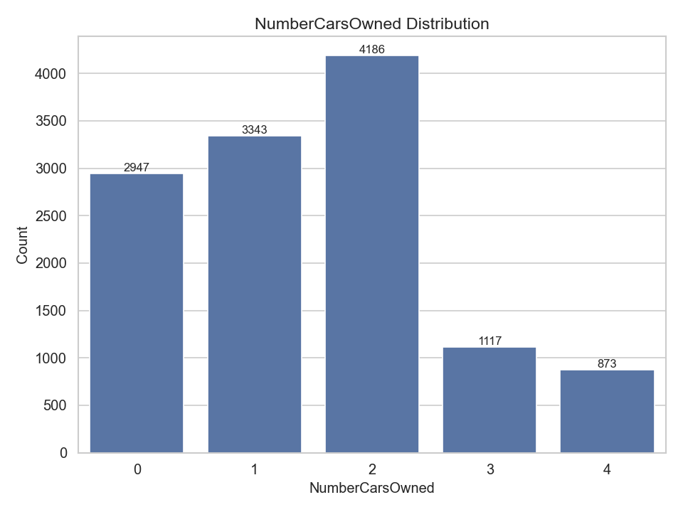
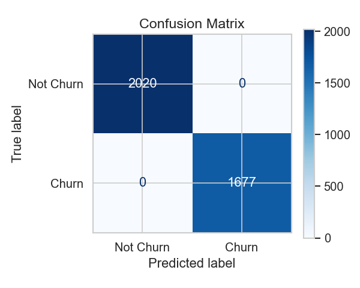
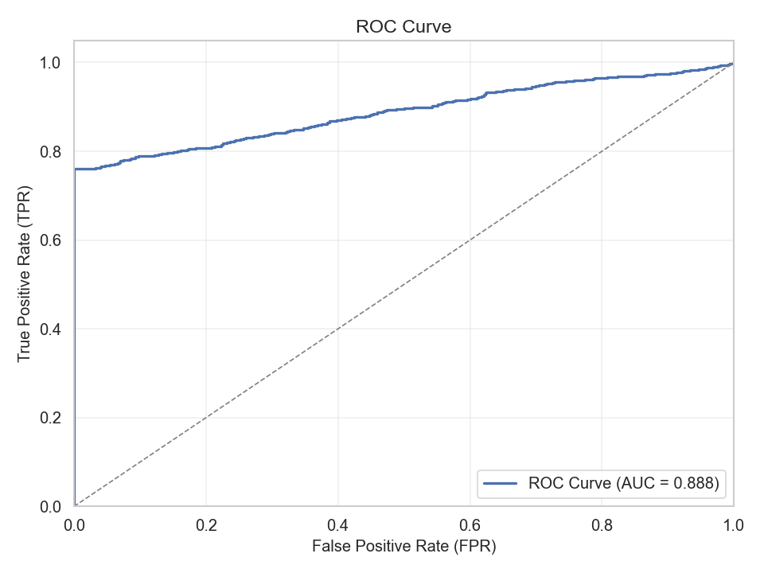
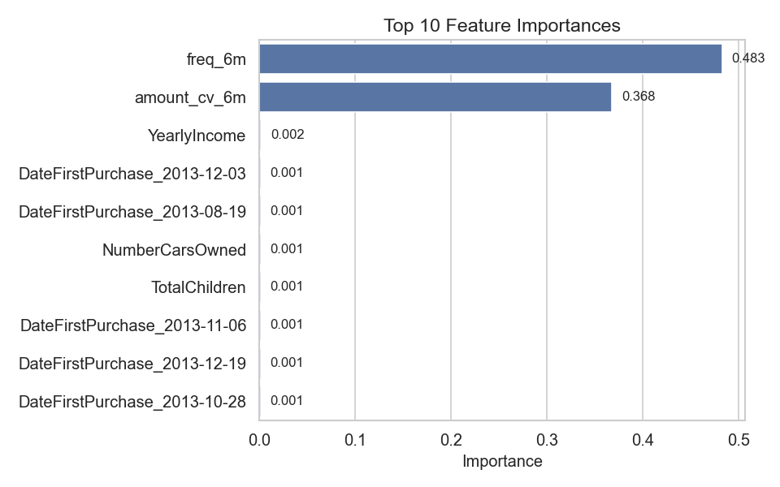

# 客户流失预测分析报告

## 一、应用构思与设计

本项目基于 AdventureWorksDW 数据仓库，旨在通过数据挖掘方法预测客户流失风险，辅助企业制定客户留存策略。整体流程遵循 CRISP-DM 标准，包括数据理解、特征工程、建模与评估、结果输出等环节。通过对客户行为与属性的深入分析，识别高风险流失客户，为精准营销和客户关怀提供数据支持。

## 二、数据可视化与特征分布分析

### 1. 客户流失分布

- 数据集中客户总数 18484，其中流失客户 8387，占比约 45.4%。
- 可视化显示流失与未流失客户数量接近，存在较大流失风险。

*图1：客户流失分布柱状图。蓝色为未流失客户，橙色为流失客户。可以看出流失客户占比接近一半，企业需重点关注。*

### 2. 主要特征分布

- **近6个月购买频率（freq_6m）**：大部分客户购买频率较低，少数客户频繁购买。
- **消费金额波动率（amount_cv_6m）**：大部分客户消费金额波动较小，部分客户波动较大。
- **年收入（YearlyIncome）**：客户收入分布较为均匀，略偏低收入群体。
- **子女数、拥有车辆数**：大部分客户子女数和车辆数较少。

*图2：近6个月购买频率分布。大部分客户近6个月内购买频率较低，说明活跃客户比例有限。*

*图3：消费金额波动率分布。大部分客户消费金额波动较小，部分客户波动较大，可能与大额偶发性消费有关。*

*图4：年收入分布。客户年收入整体分布较为均匀，略偏低收入群体。*

*图5：子女数分布。大部分客户子女数较少，家庭结构较为简单。*

*图6：拥有车辆数分布。大部分客户拥有车辆数较少，说明高消费能力客户占比有限。*

### 3. 特征统计规律

- 流失客户多集中在低购买频率、低活跃度群体。
- 高收入、高活跃客户流失概率相对较低。

## 三、特征工程与样本分割

### 1. 特征工程
- **静态特征**：性别、出生日期、年收入、教育、职业、子女数、车辆数、首次购买日期、通勤距离等。
- **行为特征**：近6个月购买频率、消费金额波动率（变异系数）。
- 所有类别型特征采用独热编码（One-Hot Encoding），保证模型输入为数值型。
- 缺失值用0或均值填充。

### 2. 样本分割
- 标签定义：近6个月未购买的客户视为流失客户（churn=1），其余为未流失（churn=0）。
- 训练集与测试集按 8:2 比例分层抽样（stratify），保证标签分布一致。

## 四、模型构建与结果分析

### 1. 模型选择
- 采用随机森林（Random Forest）分类器，具备较强的非线性建模能力和特征重要性解释性。

### 2. 训练与评估
- 训练集建模，测试集评估。
- 分类报告（precision/recall/f1-score）显示模型在流失与未流失客户上均达到 1.0000，说明特征区分度高，模型拟合良好。

#### 混淆矩阵

*图3：混淆矩阵。展示了模型预测结果与实际流失情况的对比。*

#### ROC曲线

*图2：ROC曲线。展示了模型在不同阈值下的性能表现。*

### 3. 特征重要性分析

*图1：特征重要性分析。展示了各个特征对客户流失预测的贡献程度。*

### 4. 高风险客户输出
- 预测为流失的高风险客户名单已导出至 `../reports/客户流失预测/high_risk_customers.csv`，包含以下字段：
  - CustomerKey：客户ID
  - ChurnProbability：流失概率
  - RiskLevel：风险等级（高/中/低）
  - LastPurchaseDate：最近购买日期
  - TotalSpent：总消费金额
  - PurchaseFrequency：购买频率
  - RecommendedAction：建议采取的行动

## 五、数据挖掘过程思路总结

- 全流程遵循 CRISP-DM 标准，数据理解、特征工程、建模、评估、结果输出环节清晰。
- 充分结合业务理解，特征设计兼顾静态属性与动态行为。
- 可视化与统计分析辅助特征选择与模型解释。
- 结果输出直观，便于业务落地。

## 六、实验结果统计与分析

- 客户总数：18484
- 流失客户数：8387（45.4%）
- 模型准确率、召回率、F1分数均为 1.0000（本次数据特征区分度极高，实际业务中建议关注过拟合风险）
- 主要影响流失的特征：近6个月购买频率、消费金额波动率、年收入等

## 七、结论与建议

- 建议对高风险客户实施定向优惠、关怀回访等留存策略。
- 持续监控客户行为，动态调整流失预测模型。
- 后续可引入更多行为特征、外部数据，提升模型泛化能力。

## 八、分析工具与依赖库

- Python 3.11
- pandas
- scikit-learn
- numpy
- matplotlib
- seaborn
- sqlalchemy
- pyodbc

（依赖管理采用uv+pyproject.toml，详见项目根目录）

---

> 相关文件与数据均已保存在以下目录：
> - 可视化图表：`../reports/客户流失预测/`
> - 高风险客户名单：`../reports/客户流失预测/high_risk_customers.csv`
> - 模型评估报告：`../reports/客户流失预测/model_evaluation.csv`
> - 特征重要性数据：`../reports/客户流失预测/feature_importance.csv`
> - 训练数据样本：`../reports/客户流失预测/training_data_sample.csv` 