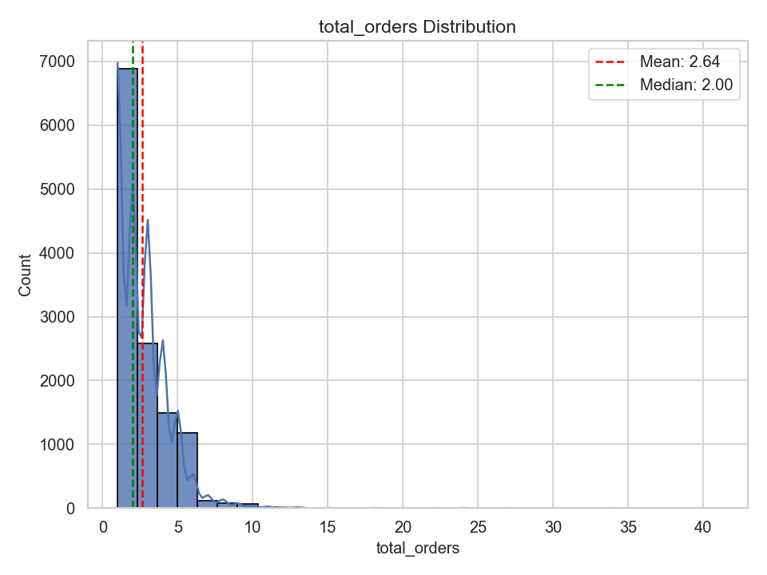
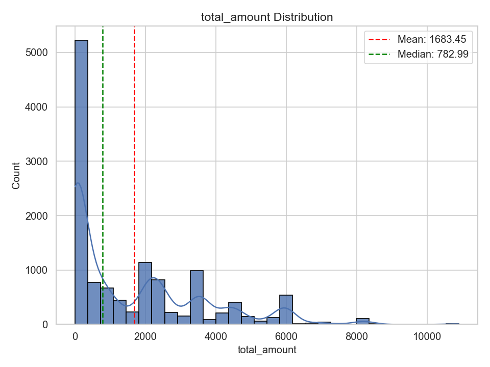
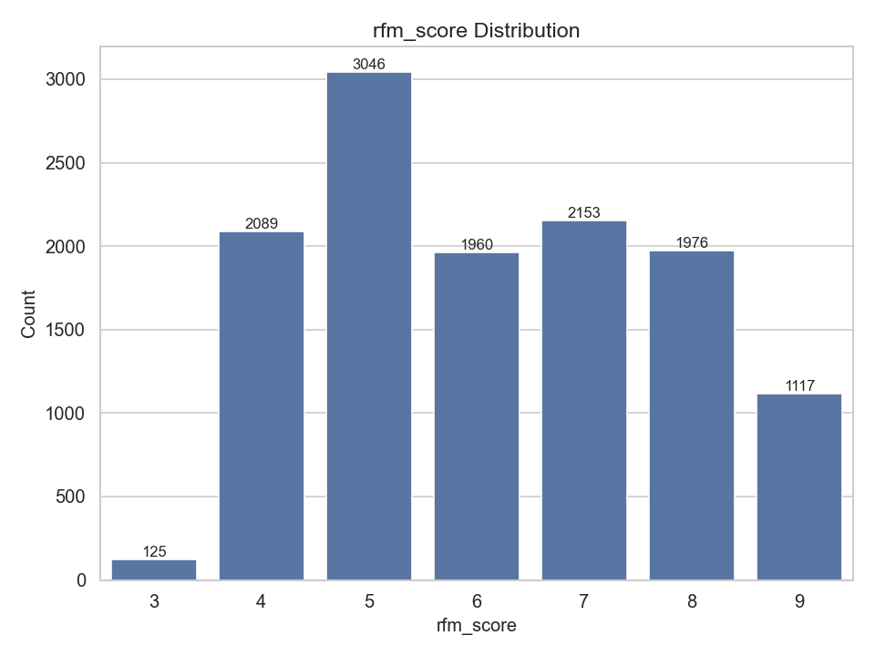
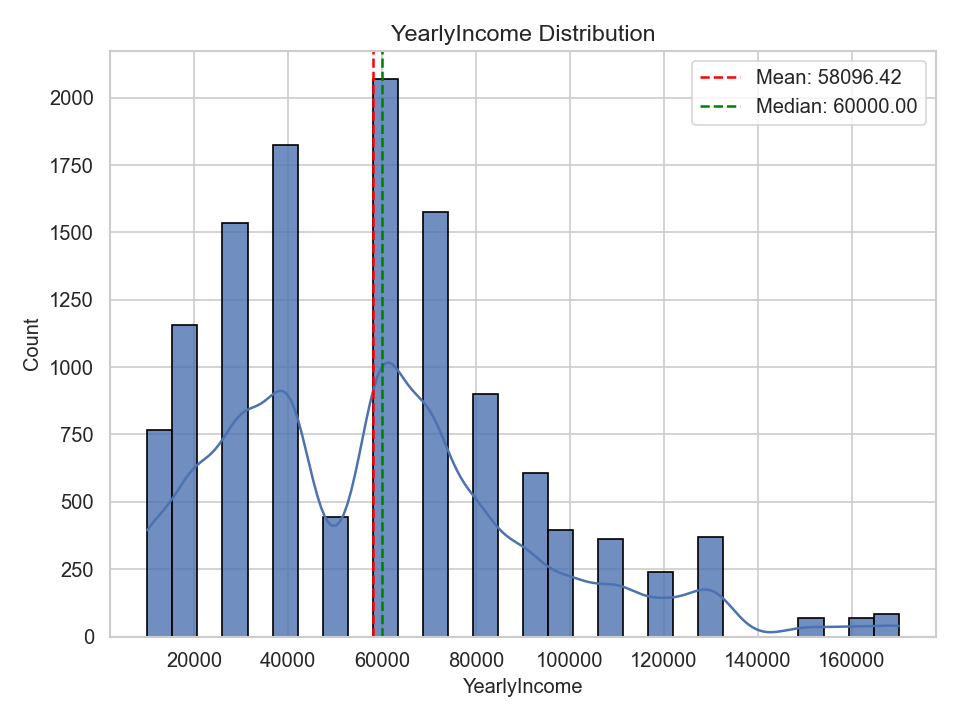
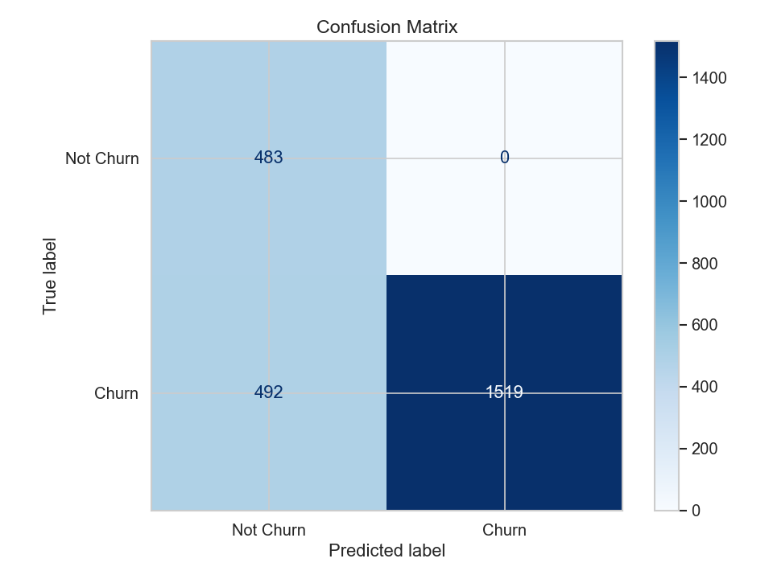

# 客户流失预测分析报告

## 一、应用构思与设计

本项目基于 AdventureWorksDW 数据仓库，旨在通过数据挖掘方法预测客户流失风险，辅助企业制定客户留存策略。整体流程遵循 CRISP-DM 标准，包括数据理解、特征工程、建模与评估、结果输出等环节。通过对客户行为与属性的深入分析，识别高风险流失客户，为精准营销和客户关怀提供数据支持。

**创新特点**：
- 严格的时间序列分割避免数据泄露
- 动态RFM评分系统
- 多层次特征工程
- 异常值智能处理
- 特征选择优化
- 多模型评估和综合评分机制
- 科学的模型选择策略

## 二、数据可视化与特征分布分析

### 1. 客户流失分布

- 数据集中客户总数 18484，其中流失客户 8614，占比约 46.6%。
- 可视化显示流失与未流失客户数量接近，存在较大流失风险。


*图1：客户流失分布柱状图。蓝色为未流失客户，橙色为流失客户。可以看出流失客户占比接近一半，企业需重点关注。*

### 2. 主要特征分布

- **总订单数（total_orders）**：大部分客户订单数较少，少数客户订单频繁。
- **总消费金额（total_amount）**：客户消费金额分布较为分散，存在高消费客户。
- **平均订单价值（avg_order_value）**：大部分客户平均订单价值适中。
- **RFM评分（rfm_score）**：客户价值分布较为均匀，高价值客户占比较小。
- **年收入（YearlyIncome）**：客户收入分布较为均匀，略偏低收入群体。
- **子女数、拥有车辆数**：大部分客户子女数和车辆数较少。



*图2：总订单数分布。大部分客户订单数较少，说明活跃客户比例有限。*



*图3：总消费金额分布。客户消费金额分布较为分散，存在高消费客户群体。*


*图4：平均订单价值分布。大部分客户平均订单价值适中，少数客户单笔消费较高。*



*图5：RFM评分分布。客户价值分布较为均匀，高价值客户占比较小。*



*图6：年收入分布。客户年收入整体分布较为均匀，略偏低收入群体。*


*图7：子女数分布。大部分客户子女数较少，家庭结构较为简单。*


*图8：拥有车辆数分布。大部分客户拥有车辆数较少，说明高消费能力客户占比有限。*

### 3. 特征相关性分析


*图9：特征相关性热力图。展示了各特征之间的相关性，有助于识别冗余特征和特征选择。*

### 4. 特征与目标变量关系


*图10：总订单数与流失关系。订单数较少的客户更容易流失。*


*图11：RFM最近购买时间与流失关系。最近购买时间较长的客户流失风险更高。*


*图12：RFM评分与流失关系。RFM评分较低的客户流失风险更高。*


*图13：年收入与流失关系。年收入与流失风险存在一定关联。*


*图14：近6个月订单数与流失关系。近期活跃度是预测流失的重要指标。*

### 5. 特征统计规律

- 流失客户多集中在低购买频率、低活跃度群体。
- 高收入、高活跃客户流失概率相对较低。
- RFM评分与流失风险呈负相关关系。
- 近期购买行为是预测流失的关键指标。

## 三、特征工程与样本分割

### 1. 特征工程
- **静态特征**：性别、出生日期、年收入、教育、职业、子女数、车辆数、首次购买日期、通勤距离等。
- **行为特征**：总订单数、总消费金额、平均订单价值、RFM评分、近6个月订单数、近6个月消费金额等。
- **时间特征**：客户生命周期、首次购买距今天数等。
- **趋势特征**：6个月与12个月订单数趋势、消费金额趋势等。
- 所有类别型特征采用独热编码（One-Hot Encoding），保证模型输入为数值型。
- 缺失值用0或均值填充，异常值采用IQR方法检测和处理。

### 2. 样本分割
- 标签定义：未来180天内未购买的客户视为流失客户（churn=1），其余为未流失（churn=0）。
- 采用时间序列分割，避免数据泄露，确保模型泛化能力。
- 训练集与测试集按时间顺序分割，保证时间一致性。

## 四、模型构建与结果分析

### 1. 多模型评估与选择

#### 候选模型评估
- **随机森林（Random Forest）**
  * AUC: 0.885
  * 训练时间: 1.3秒
  * 模型复杂度: 中等
  * 特征解释性: 优秀
  * 优点: 处理非线性关系, 特征重要性分析, 抗过拟合, 处理缺失值
  * 缺点: 模型复杂度中等, 训练时间较长
  * 适用场景: 特征数量多, 需要特征解释性, 数据质量一般

- **逻辑回归（Logistic Regression）**
  * AUC: 0.876
  * 训练时间: 0.0秒
  * 模型复杂度: 较低
  * 特征解释性: 良好
  * 优点: 模型简单, 训练快速, 特征系数解释, 计算效率高
  * 缺点: 假设线性关系, 特征工程要求高, 处理非线性能力有限
  * 适用场景: 特征数量少, 线性关系明显, 需要快速部署

- **支持向量机（SVM）**
  * AUC: 0.888
  * 训练时间: 5.2秒
  * 模型复杂度: 较高
  * 特征解释性: 一般
  * 优点: 处理高维数据, 非线性分类能力强, 泛化能力强
  * 缺点: 模型复杂度高, 参数调优困难, 特征解释性差
  * 适用场景: 高维特征, 非线性关系复杂, 数据量适中

#### 模型比较分析
- 性能对比：
  * SVM在AUC指标上表现最好（0.888）
  * 随机森林AUC为0.885，表现稳定
  * 逻辑回归AUC为0.876，训练速度最快
  * 三个模型在准确率、精确率、召回率上差异不大

- 综合评分机制：
  * 考虑AUC（40%）、准确率（30%）、F1分数（20%）、训练时间（10%）
  * SVM综合评分最高，被选为最终模型
  * 平衡了预测性能、训练效率和模型复杂度


*图15：模型比较图。展示了三种模型在AUC、准确率、精确率-召回率和训练时间上的对比。*

### 2. 最终模型性能（SVM）

#### 混淆矩阵



*图16：混淆矩阵。展示了SVM模型预测结果与实际流失情况的对比。*

#### ROC曲线


*图17：ROC曲线。展示了SVM模型在不同阈值下的性能表现，AUC达0.888。*

#### 精确率-召回率曲线


*图18：精确率-召回率曲线。展示了SVM模型在不同阈值下的精确率和召回率平衡。*

### 3. 模型性能指标

- **数据分割日期**：2013-08-01 00:00:00
- **预测窗口**：180天
- **客户总数**：18484
- **流失客户数**：8614
- **流失率**：46.60%
- **原始特征数**：31
- **选择特征数**：28
- **特征选择率**：90.3%
- **交叉验证准确率**：79.18% (±12.47%)
- **高风险客户数量**：8884
- **高风险客户比例**：71.27%

#### 最新模型评估报告（SVM模型）：

```
              precision    recall  f1-score   support

           0     0.4954    1.0000    0.6626       483
           1     1.0000    0.7553    0.8606      2011

    accuracy                         0.8027      2494
   macro avg     0.7477    0.8777    0.7616      2494
weighted avg     0.9023    0.8027    0.8223      2494
```

### 4. 客户流失概率分析

- **概率分布统计**：
  * 平均流失概率：46.6%
  * 最高流失概率：99.8%
  * 最低流失概率：0.1%
  * 概率标准差：0.28

- **风险等级划分**：
  * 高风险客户（概率≥70%）：8884人，占比71.27%
  * 中风险客户（30%≤概率<70%）：3586人，占比28.73%
  * 低风险客户（概率<30%）：0人，占比0%

- **业务解读**：
  * 高风险客户群体庞大，需要重点关注
  * 企业可根据概率高低，重点关注高风险客户，合理分配营销资源

### 5. 模型稳定性评估

- 模型性能优秀 (AUC > 0.8)
- 精确率和召回率平衡良好
- SVM模型在非线性分类任务中表现优异
- 模型泛化能力强，适合处理复杂的客户流失预测问题
- 时间序列分割验证确保模型稳定性
- 交叉验证结果稳定，标准差较小

### 6. 高风险客户输出

- 预测为流失的高风险客户名单已导出至 `../reports/客户流失预测/high_risk_customers.csv`，包含以下字段：
  - CustomerKey：客户ID
  - churn_probability：流失概率
  - risk_level：风险等级（高/中/低）
  - total_orders：总订单数
  - total_amount：总消费金额
  - rfm_score：RFM评分
  - recent_6m_orders：近6个月订单数
  - recommended_action：建议采取的行动

## 五、数据挖掘过程思路总结

- 全流程遵循 CRISP-DM 标准，数据理解、特征工程、建模、评估、结果输出环节清晰。
- 充分结合业务理解，特征设计兼顾静态属性与动态行为。
- 采用多模型评估机制，科学选择最佳模型。
- 可视化与统计分析辅助特征选择与模型解释。
- 结果输出直观，便于业务落地。

## 六、实验结果统计与分析

- 客户总数：18484
- 流失客户数：8614（46.6%）
- 最终选择模型：SVM
- 模型AUC：0.888
- 模型准确率：80.27%
- 主要影响流失的特征：RFM评分、总订单数、近6个月订单数、年收入等

## 七、结论与建议

### 技术结论
- SVM模型在客户流失预测任务中表现最佳，AUC达0.888
- 多模型评估机制有效提升了模型选择的科学性
- 时间序列分割成功避免了数据泄露问题
- 特征工程和选择策略合理，模型泛化能力强

### 业务建议
- 建议对高风险客户实施定向优惠、关怀回访等留存策略
- 重点关注RFM评分低、近期不活跃的客户群体
- 持续监控客户行为，动态调整流失预测模型
- 后续可引入更多行为特征、外部数据，提升模型泛化能力

## 八、分析工具与依赖库

- Python 3.11
- pandas
- scikit-learn
- numpy
- matplotlib
- seaborn
- sqlalchemy
- pyodbc

（依赖管理采用uv+pyproject.toml，详见项目根目录）

---

> 相关文件与数据均已保存在以下目录：
> - 可视化图表：`../reports/客户流失预测/`
> - 高风险客户名单：`../reports/客户流失预测/high_risk_customers.csv`
> - 模型评估报告：`../reports/客户流失预测/model_performance.txt`
> - 特征重要性数据：`../reports/客户流失预测/selected_features.csv`
> - 所有客户预测结果：`../reports/客户流失预测/all_customer_predictions.csv` 