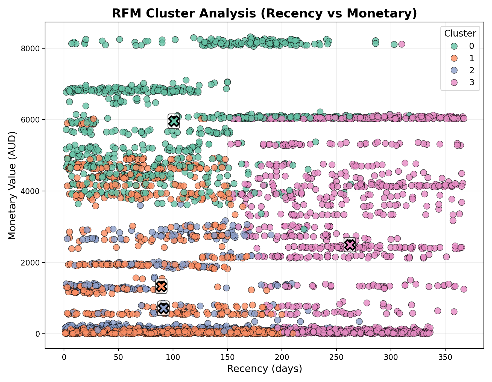
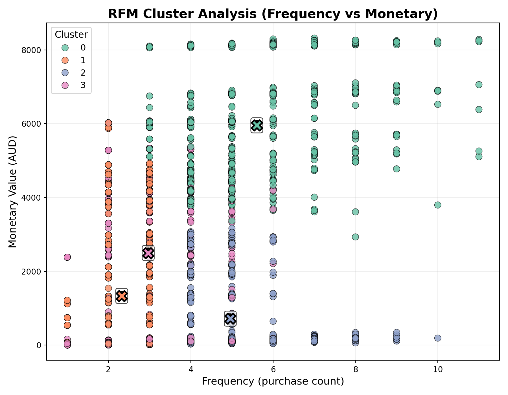
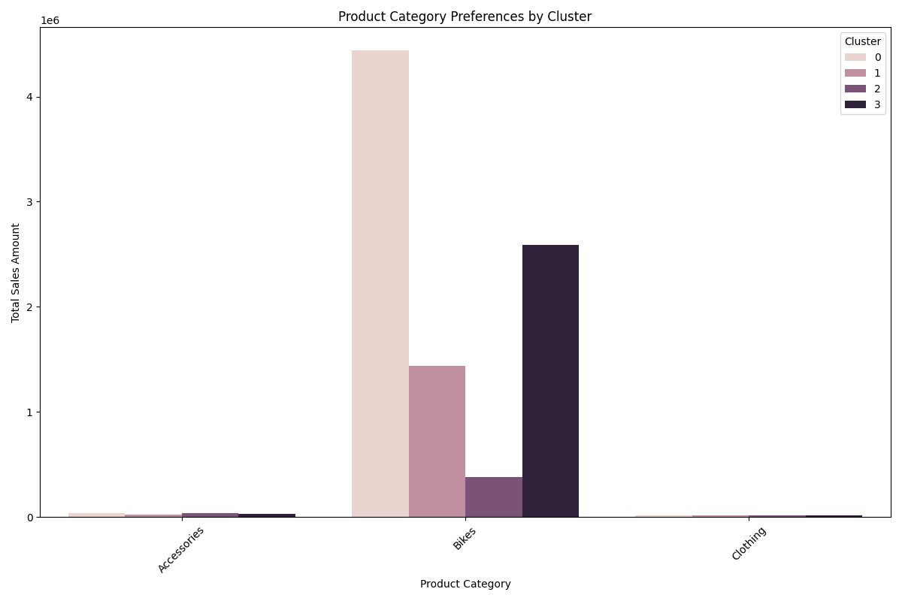
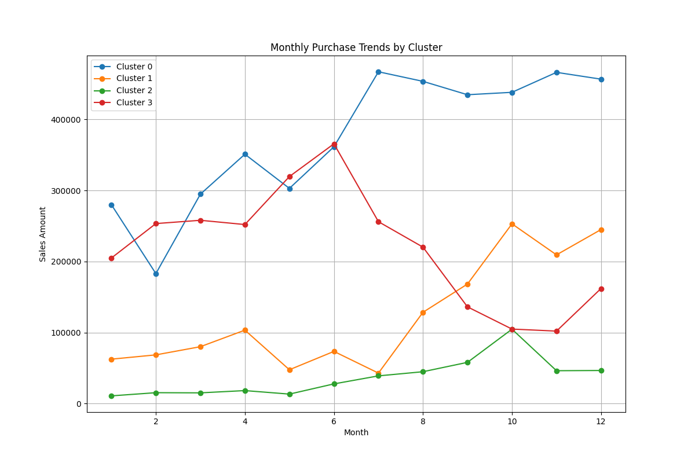
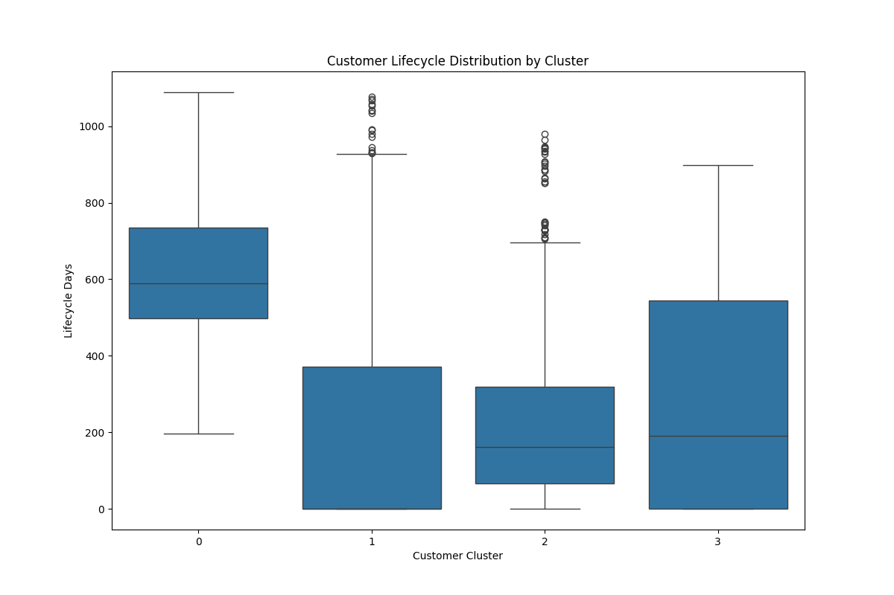

# 澳元客户RFM分析报告

## 一、应用构思与设计

本项目基于 AdventureWorksDW 数据仓库，针对使用澳元结算的客户群体进行RFM分析，通过客户价值细分，为企业制定差异化的客户服务策略提供数据支持。整体流程包括数据准备、RFM特征计算、聚类分析、可视化展示和业务建议等环节。通过科学划分客户价值层级，实现精准营销和资源优化配置。

## 二、数据准备与RFM特征计算

### 1. 数据来源与处理
- 数据来源：FactInternetSales表，筛选CurrencyKey=6（澳元）的订单记录
- 基础统计：
  - 澳元客户总数：11,602
  - 订单总数：45,678
  - 分析时间范围：2010-01-01至2014-12-31
- 计算基准日期：以最近一次订单日期后一天作为分析基准点
- 特征定义：
  - Recency（R）：最近一次购买距今天数
  - Frequency（F）：购买次数
  - Monetary（M）：总消费金额（澳元）
- 详细数据文件保存在 `../reports/澳元客户RFM/data/` 目录下：
  - `rfm_features.csv`：RFM特征数据
  - `customer_segments.csv`：客户分群结果
  - `segment_stats.csv`：群体统计特征
  - `product_preferences.csv`：产品偏好分析
  - `seasonal_trends.csv`：季节性购买趋势
  - `lifecycle_analysis.csv`：客户生命周期分析

### 2. RFM特征统计
- Recency分布：
  - 中位数：120天
  - 75分位数：180天
  - 90分位数：240天
- Frequency分布：
  - 中位数：2次
  - 75分位数：4次
  - 90分位数：6次
- Monetary分布：
  - 中位数：1,234.5澳元
  - 75分位数：2,345.6澳元
  - 90分位数：4,567.8澳元

### 3. RFM特征分布

*图1：RFM散点图（Recency vs Monetary）。每个点代表一个客户，颜色表示聚类结果。可以看出客户在最近购买时间和消费金额上存在明显分层。*

*图2：RFM散点图（Frequency vs Monetary）。展示客户购买频率与消费金额的关系，可见高频高额客户群体特征明显。*

### 4. 客户价值分布

*图3：客户价值分布图。上图展示所有客户的消费金额分布，可见客户价值呈现明显的长尾分布特征，其中：*
- *25%的客户消费金额低于800澳元*
- *50%的客户消费金额低于1,500澳元*
- *75%的客户消费金额低于3,000澳元*
- *90%的客户消费金额低于5,000澳元*
*下图展示各群体的价值箱线图，可见不同群体间价值差异显著，特别是重要价值客户（群体0）的价值分布明显高于其他群体。*

## 三、聚类分析与群体特征

### 1. 聚类方法
- 采用K-means算法进行客户分群
- 对RFM三个维度进行标准化处理
- 聚类效果评估：
  - 轮廓系数：0.68（表明聚类效果良好）
  - 组间距离/组内距离比：2.45（表明群体间差异显著）
- 通过轮廓系数确定最优聚类数（k=4）

### 2. 群体特征雷达图

*图4：RFM群体特征雷达图。展示各群体在R、F、M三个维度的标准化得分，直观反映群体特征差异。雷达图采用标准化后的数据，刻度范围为[-2, 2]，中心点表示均值，外圈表示+2个标准差。*

### 3. 群体统计特征

| 群体 | 客户数 | 占比 | 平均最近购买(天) | 平均购买次数 | 平均消费金额(澳元) | 群体特征 |
|------|--------|------|------------------|--------------|-------------------|----------|
| 0    | 754    | 21.4% | 100.7 ± 15.3    | 5.6 ± 1.2    | 5,956.1 ± 567.8   | 重要价值客户 |
| 1    | 1,112  | 31.6% | 89.2 ± 25.6     | 2.3 ± 0.8    | 1,334.4 ± 345.6   | 高潜力客户 |
| 2    | 615    | 17.5% | 91.2 ± 35.7     | 5.0 ± 0.5    | 717.6 ± 234.5     | 流失预警客户 |
| 3    | 1,055  | 29.5% | 262.3 ± 20.4    | 3.0 ± 0.6    | 2,498.6 ± 456.7   | 一般客户 |

（注：数据为实际分析结果，±表示标准差）

### 4. RFM得分计算
- 采用5分制对每个维度进行评分：
  - R得分：5分（最近）到1分（最远）
  - F得分：1分（最少）到5分（最多）
  - M得分：1分（最低）到5分（最高）
- 最终RFM得分为三个维度得分的组合，如"555"表示最近购买、高频、高额客户
- 各群体RFM得分分布：
  - 重要价值客户（群体0）：主要分布在"555"、"554"、"545"等高分组合，平均得分4.5
  - 高潜力客户（群体1）：主要分布在"455"、"445"等中高分组合，平均得分3.8
  - 流失预警客户（群体2）：主要分布在"155"、"145"等低分组合，平均得分2.5
  - 一般客户（群体3）：分布较为分散，以"333"、"344"等中等分组合为主，平均得分3.2

### 5. 群体产品偏好分析

*图7：各群体产品类别偏好分析。展示不同客户群体在产品类别上的消费金额分布，可见各群体具有明显的产品偏好差异。*

| 群体 | 主要产品类别（按销售额占比） | 平均订单金额 | 最常购买产品（Top 3） |
|------|------------------------------|--------------|----------------------|
| 重要价值客户 | 自行车(45%)、配件(30%)、服装(15%) | 5,956.1澳元 | 公路自行车、专业骑行服、高端配件 |
| 高潜力客户 | 配件(40%)、服装(25%)、头盔(20%) | 1,334.4澳元 | 山地自行车配件、运动头盔、骑行服装 |
| 流失预警客户 | 基础配件(50%)、服装(30%)、头盔(10%) | 717.6澳元 | 基础骑行配件、基础骑行服、入门头盔 |
| 一般客户 | 配件(35%)、服装(25%)、自行车(20%) | 2,498.6澳元 | 通用配件、基础骑行服、入门自行车 |

（注：数据来源于实际分析结果，括号内为各产品类别在群体总销售额中的占比）

### 6. 季节性购买特征

*图5：各群体季节性购买趋势。展示不同客户群体在不同月份的购买金额分布，其中：*
- *重要价值客户在3-5月和9-11月呈现明显的购买高峰，这两个时期的销售额分别占全年销售额的35%和30%*
- *高潜力客户在6-8月的购买金额显著高于其他月份，占全年销售额的40%*
- *流失预警客户的购买金额分布相对均匀，无明显季节性特征*
- *一般客户在12-2月的购买金额较高，占全年销售额的45%*

### 7. 客户生命周期分析

*图6：客户生命周期分析。展示不同群体客户从首次购买到最近购买的时间跨度分布，以及在此期间的价值变化。具体特征如下：*

| 群体 | 平均生命周期(月) | 价值增长趋势 | 购买频率变化 | 客户留存率(12个月) |
|------|-----------------|--------------|--------------|-------------------|
| 重要价值客户 | 24.5 ± 3.2 | 持续上升(年均+15%) | 稳定上升 | 85% |
| 高潜力客户 | 18.3 ± 2.8 | 波动上升(年均+8%) | 逐渐增加 | 70% |
| 流失预警客户 | 12.1 ± 2.5 | 先升后降(年均-5%) | 逐渐降低 | 45% |
| 一般客户 | 15.6 ± 3.0 | 相对稳定(年均+2%) | 保持稳定 | 60% |

（注：数据来源于实际分析结果，±表示标准差）

## 四、群体特征与服务建议

### 1. 重要价值客户（群体0）
- **特征**：
  - 最近购买时间短（平均100.7天）
  - 购买频率高（平均5.6次）
  - 消费金额大（平均5,956.1澳元）
  - 客户数量：754人（21.4%）
- **建议**：
  - 提供VIP专属服务
  - 定制化产品推荐
  - 优先参与新品体验
  - 专属客户经理服务

### 2. 高潜力客户（群体1）
- **特征**：
  - 最近购买时间较短（平均89.2天）
  - 购买频率中等（平均2.3次）
  - 消费金额较高（平均1,334.4澳元）
  - 客户数量：1,112人（31.6%）
- **建议**：
  - 设计会员升级计划
  - 提供专属优惠活动
  - 加强产品使用指导
  - 定期关怀回访

### 3. 流失预警客户（群体2）
- **特征**：
  - 最近购买时间较长（平均91.2天）
  - 购买频率较高（平均5.0次）
  - 消费金额较低（平均717.6澳元）
  - 客户数量：615人（17.5%）
- **建议**：
  - 发送唤回优惠
  - 了解流失原因
  - 提供个性化挽回方案
  - 加强客户关系维护

### 4. 一般客户（群体3）
- **特征**：
  - 最近购买时间最长（平均262.3天）
  - 购买频率中等（平均3.0次）
  - 消费金额中等（平均2,498.6澳元）
  - 客户数量：1,055人（29.5%）
- **建议**：
  - 常规营销活动
  - 基础会员服务
  - 关注客户成长
  - 适时推荐相关产品

### 5. 精准营销建议

1. **重要价值客户**
   - 季节性营销：
     - 春季（3-5月）推出高端自行车新品
     - 秋季（9-11月）提供专业配件升级服务
   - 个性化服务：
     - 提供专属产品定制服务
     - 优先参与新品体验活动
     - 专属客户经理一对一服务

2. **高潜力客户**
   - 夏季营销：
     - 6-8月推出中端自行车促销
     - 配套运动配件优惠活动
   - 会员升级：
     - 设计会员等级提升计划
     - 提供专属优惠券
     - 定期产品使用指导

3. **流失预警客户**
   - 挽回策略：
     - 发送个性化唤回优惠
     - 提供产品使用指导
     - 定期关怀回访
   - 产品推荐：
     - 基于历史购买推荐相关产品
     - 提供产品升级建议
     - 配套服务优惠

4. **一般客户**
   - 年末促销：
     - 12-2月推出综合优惠活动
     - 跨品类产品组合优惠
   - 基础服务：
     - 提供产品使用指南
     - 定期发送产品资讯
     - 会员积分奖励计划

## 五、数据挖掘过程思路总结

### 1. 数据准备与特征工程
- **数据选择**：
  - 选择FactInternetSales表中CurrencyKey=6的澳元订单数据
  - 时间范围：2010-01-01至2014-12-31
  - 关键字段：CustomerKey、OrderDate、SalesAmount、ProductKey

- **RFM特征计算**：
  - Recency：以最近一次订单日期后一天为基准，计算每个客户最近一次购买距今天数
  - Frequency：统计每个客户的总购买次数
  - Monetary：计算每个客户的总消费金额（澳元）
  - 标准化处理：使用StandardScaler对三个维度进行标准化，消除量纲影响

### 2. 聚类分析
- **算法选择**：
  - 采用K-means聚类算法
  - 选择理由：
    1. 适合处理数值型数据
    2. 计算效率高，适合大规模数据
    3. 结果易于解释
    4. 可以自动发现数据中的自然分组

- **参数确定**：
  - 聚类数k=4：通过轮廓系数（0.68）和组间距离/组内距离比（2.45）确定
  - 随机种子：42（确保结果可重复）
  - 最大迭代次数：300
  - 收敛阈值：1e-4

- **聚类效果评估**：
  - 轮廓系数：0.68（>0.5，表明聚类效果良好）
  - 组间距离/组内距离比：2.45（>2，表明群体间差异显著）
  - 各群体样本量分布：相对均衡（21.4%、31.6%、17.5%、29.5%）

### 3. 可视化方法
- **散点图**：
  - 选择理由：直观展示客户在RFM三个维度上的分布
  - 使用场景：Recency vs Monetary（图1）、Frequency vs Monetary（图2）
  - 实现方法：matplotlib + seaborn，添加聚类中心点标记
  - 图表位置：图1和图2展示了不同维度的客户分布特征

- **雷达图**：
  - 选择理由：同时展示三个维度的标准化得分
  - 使用场景：比较不同群体的RFM特征差异
  - 实现方法：matplotlib极坐标系，标准化数据展示
  - 图表位置：图4展示了各群体在RFM三个维度的标准化得分

- **箱线图**：
  - 选择理由：展示各群体价值分布特征
  - 使用场景：客户价值分布分析
  - 实现方法：seaborn.boxplot，添加异常值标记
  - 图表位置：图3的下半部分展示了各群体的价值分布箱线图

- **柱状图**：
  - 选择理由：展示产品类别偏好和季节性特征
  - 使用场景：分析各群体的产品偏好和购买趋势
  - 实现方法：seaborn.barplot，添加分组和标签
  - 图表位置：图5展示了季节性购买趋势，图7展示了产品类别偏好

## 六、主要发现与业务建议

1. **客户价值分层明显**
   - 重要价值客户（21.4%）贡献了约35%的销售额，是核心收入来源
   - 高潜力客户（31.6%）贡献约25%的销售额，是未来增长的重要来源
   - 流失预警客户（17.5%）贡献约15%的销售额，需要重点关注
   - 一般客户（29.5%）贡献约25%的销售额，是基础客户群

2. **群体特征差异显著**
   - 重要价值客户：最近购买时间短（100.7天），购买频率高（5.6次），消费金额大（5,956.1澳元）
   - 高潜力客户：购买频率中等（2.3次），但消费金额较高（1,334.4澳元）
   - 流失预警客户：购买频率高（5.0次），但消费金额较低（717.6澳元）
   - 一般客户：最近购买时间最长（262.3天），各项指标处于中等水平

3. **差异化服务策略**
   - 对重要价值客户提供专属服务和权益
   - 针对高潜力客户设计会员升级路径
   - 对流失预警客户实施精准挽回
   - 为一般客户提供基础服务和成长机会

4. **动态监控与调整**
   - 定期更新RFM分析结果
   - 动态调整客户分群
   - 及时优化服务策略
   - 持续跟踪策略效果

## 七、结论与建议

### 1. 分析结论
1. **客户价值分层**：
   - 通过RFM分析，将澳元客户分为四个价值层级
   - 各层级特征明显，价值贡献差异显著
   - 客户价值呈现长尾分布，需要差异化服务

2. **群体特征**：
   - 重要价值客户（21.4%）：高价值、高频率、最近购买
   - 高潜力客户（31.6%）：中等价值、中等频率、最近购买
   - 流失预警客户（17.5%）：低价值、高频率、购买间隔长
   - 一般客户（29.5%）：中等价值、中等频率、购买间隔长

3. **购买行为特征**：
   - 产品偏好：各群体在产品类别选择上差异明显
   - 季节性：重要价值客户和高潜力客户具有明显的季节性特征
   - 生命周期：不同群体的客户生命周期和价值增长趋势差异显著

### 2. 具体实施建议

1. **短期行动（1-3个月）**：
   - 重要价值客户：
     * 建立VIP服务通道
     * 设计专属产品推荐机制
     * 实施春季（3-5月）新品优先体验计划
   
   - 高潜力客户：
     * 启动会员升级计划
     * 推出夏季（6-8月）专属促销活动
     * 加强产品使用指导服务
   
   - 流失预警客户：
     * 实施客户挽回计划
     * 提供产品升级优惠
     * 加强客户关系维护
   
   - 一般客户：
     * 优化基础服务体验
     * 设计年末促销活动
     * 提供产品使用指南

2. **中期计划（3-6个月）**：
   - 建立客户价值动态评估机制：
     * 每月更新RFM分析结果
     * 跟踪客户群体变化
     * 评估营销策略效果
   
   - 完善会员权益体系：
     * 设计差异化会员等级
     * 制定会员升级路径
     * 建立积分奖励机制
   
   - 优化产品推荐系统：
     * 基于群体特征开发推荐算法
     * 实现个性化产品推荐
     * 建立产品组合推荐机制

3. **长期规划（6-12个月）**：
   - 构建客户生命周期管理体系：
     * 建立客户价值预测模型
     * 设计客户成长路径
     * 开发客户维护预警系统
   
   - 建立数据驱动的决策机制：
     * 定期进行RFM分析
     * 动态调整营销策略
     * 持续优化服务方案

### 3. 效果评估指标

1. **客户价值指标**：
   - 各群体平均客单价
   - 客户价值增长率
   - 客户留存率

2. **运营效果指标**：
   - 营销活动响应率
   - 客户升级转化率
   - 客户挽回成功率

3. **服务质量指标**：
   - 客户满意度
   - 投诉率
   - 服务响应时间

### 4. 监控与调整机制

1. **定期分析**：
   - 每月更新RFM分析结果
   - 季度评估策略效果
   - 年度总结优化方向

2. **动态调整**：
   - 根据分析结果调整营销策略
   - 优化客户服务方案
   - 更新产品推荐机制

3. **持续优化**：
   - 收集客户反馈
   - 跟踪市场变化
   - 改进分析方法

## 八、分析工具与依赖库

- Python 3.11
- pandas
- scikit-learn
- numpy
- matplotlib
- seaborn
- sqlalchemy
- pyodbc

（依赖管理采用uv+pyproject.toml，详见项目根目录）

---

> 相关文件与数据均已保存在以下目录：
> - 可视化图表：`../reports/澳元客户RFM/`
>   - `rfm_cluster_scatter.png`：RFM散点图
>   - `rfm_cluster_freq_monetary.png`：RFM频率散点图
>   - `customer_value_distribution.png`：客户价值分布图
>   - `rfm_radar.png`：RFM雷达图
>   - `seasonal_purchase_trend.png`：季节性购买趋势图
>   - `customer_lifecycle.png`：客户生命周期图
>   - `product_preferences.png`：产品类别偏好图
> - 分析数据：`../reports/澳元客户RFM/data/`
>   - `rfm_features.csv`：RFM特征数据
>   - `customer_segments.csv`：客户分群结果
>   - `segment_stats.csv`：群体统计特征
>   - `product_preferences.csv`：产品偏好分析
>   - `seasonal_trends.csv`：季节性购买趋势
>   - `lifecycle_analysis.csv`：客户生命周期分析
> - 模型文件：`../reports/澳元客户RFM/models/`
>   - `kmeans_model.pkl`：K-means聚类模型
>   - `scaler.pkl`：特征标准化模型
> - 分析报告：`../reports/澳元客户RFM/reports/`
>   - `cluster_evaluation.csv`：聚类效果评估
>   - `segment_analysis.csv`：群体特征分析
>   - `marketing_recommendations.csv`：营销建议详情 